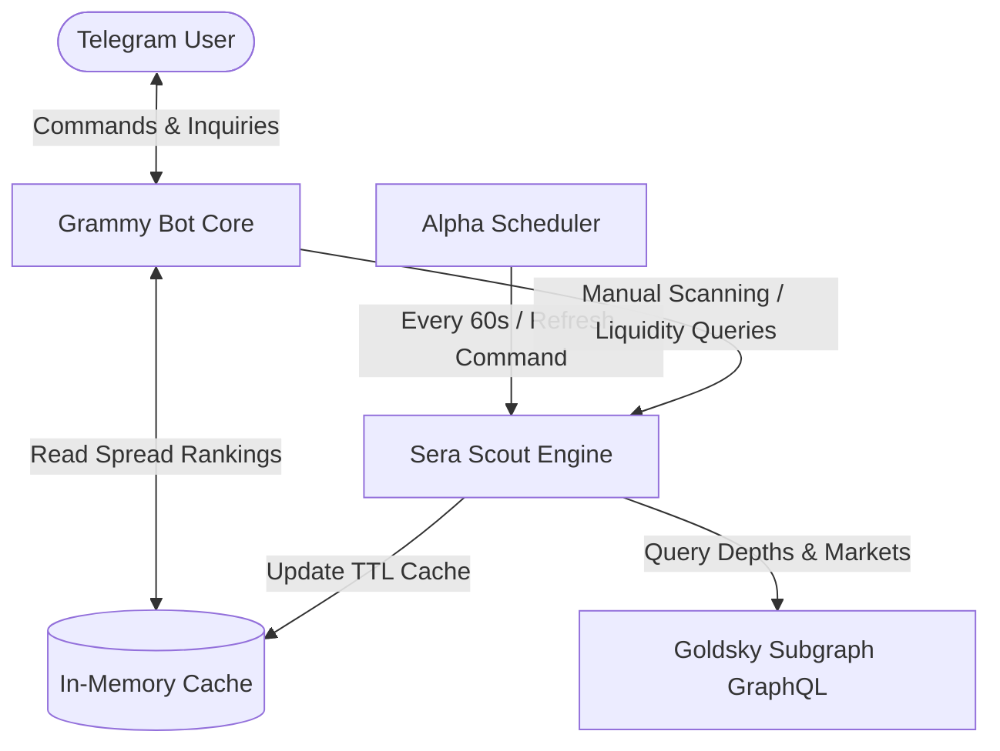

# Sera Scout 

[](https://www.typescriptlang.org/)
[](https://grammy.dev/)
[](https://nodejs.org/)
[](https://goldsky.com/)

Sera Scout is a high-performance market intelligence tool and Telegram Bot built on top of the **Sera Protocol**. It tracks and calculates real-time order book liquidity depth, bid-ask spreads, and token rankings to deliver actionable trading metrics.

---

## Architecture Flow

Sera Scout uses a decoupled architecture to prevent rate limits and ensure sub-millisecond bot response times:



---

## Key Features

*   **Alpha Board (Spread Rankings)**: Evaluates all protocol trading markets and ranks them by the tightest bid-ask spread percentages. Supported by a background TTL-based state scheduler.
*   **Liquidity Leaderboard**: Aggregates and normalizes market depths across the top 5 bids and asks levels to calculate total liquidity volumes in base tokens.
*   **Token Market Scan**: Dynamically filters active trading pairs for a specified asset and retrieves spot prices, spreads, and fee metrics.

---

## Bot Command Reference

*   `/start` — Greeting portal and command summary menu.
*   `/about` — Details bot features and architecture.
*   `/alpha` — Retrieves top 10 tightest spread pairs (instantaneous cache retrieval).
*   `/liquidity` — Ranks top 10 pairs by total liquidity volumes (top 5 bid/ask levels).
*   `/scan <TOKEN>` — Displays spot price, spread, and makers/takers fee details for any token (e.g. `/scan MYRC`).

---

## Setup & Local Execution

### Prerequisites

- Node.js (version 20.6.0 or higher is recommended for native `.env` loading)
- NPM

### 1. Installation

Clone your repository, navigate to the folder, and install the standalone dependencies:

```bash
cd sera-scout-bot
npm install
```

### 2. Configure Environment Variables

Create a `.env` file in the root directory:

```env
BOT_TOKEN=your_telegram_bot_token_here
```

*(Note: `.env` is automatically ignored by Git inside `.gitignore` to prevent secret leaks)*

### 3. Run the Services

- **Start Telegram Bot** (Runs the bot long-polling server along with the background Alpha Scheduler):
  ```bash
  npm run bot
  ```

- **Run Liquidity Test Suite** (Lists the top 10 liquid markets):
  ```bash
  npm run liquidity
  ```

- **Run Caching Test Suite** (Evaluates cache hit speeds):
  ```bash
  npm run alpha
  ```

---

## Production Deployment

For continuous, production-grade hosting, use a process manager like **PM2** or **Docker**.

### Method A: PM2 (Process Manager)

PM2 keeps the bot process alive and handles automatic restarts:

1. Install PM2 globally:
   ```bash
   npm install pm2 -g
   ```
2. Start the bot:
   ```bash
   pm2 start src/bot.ts --interpreter tsx --name "sera-scout-bot"
   ```
3. Monitor logs:
   ```bash
   pm2 logs sera-scout-bot
   ```

### Method B: Docker (Containerized)

1. Create a `Dockerfile`:
   ```dockerfile
   FROM node:20-alpine
   WORKDIR /app
   COPY package*.json ./
   RUN npm install
   COPY . .
   CMD ["npm", "run", "bot"]
   ```
2. Build and run:
   ```bash
   docker build -t sera-scout-bot .
   docker run -d --name bot-instance --env-file .env sera-scout-bot
   ```

---

## Screenshots & Previews

Here is what the bot interactions look like in Telegram:

| `/start` Menu | `/alpha` Board | `/scan` Results |
| :---: | :---: | :---: |
|  |  |  |

---

## Product Roadmap

- [ ] **Real-Time Price Alerts**: Allow users to set price trigger alerts for specific trading pairs.
- [ ] **Arbitrage Scan Engine**: Cross-reference spreads with external AMM pools (e.g. Uniswap V3) to detect flash-swap arbitrage opportunities.
- [ ] **Multi-chain Support**: Support other L2 deployments of Sera Protocol subgraphs.
- [ ] **Web Dashboard**: Visual React frontend dashboard matching the Telegram Bot API output.
