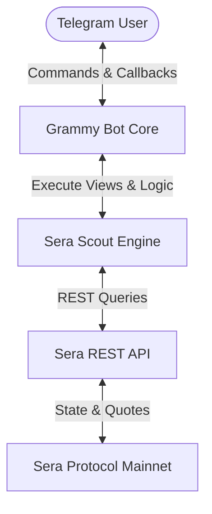

# Sera Scout (V2.5.3)

Sera Scout is a Telegram-native market intelligence and trading assistant for the **Sera Protocol** on Ethereum Mainnet. It provides intent-based price discovery, real-time liquidity stats, price alerts, and slippage-protected swap quotes.

Sera Scout is powered directly by the official **Sera Mainnet REST API**, migrating away from legacy Sepolia testnet subgraph workflows to deliver production-grade mainnet data.

---

## Architecture Flow

Sera Scout implements a lightweight, high-performance integration flow directly interfacing with the Sera Protocol Mainnet.



---

## Core Features

*   **Interactive Telegram UI** — Navigate through full-screen views, list pagination, and alert configurations using inline keyboards.
*   **Live Swap Quotes** — Fetch real-time, slippage-protected swap quotes directly from the mainnet REST API.
*   **Active Market Explorer** — Focus on high-liquidity active trading markets using `/markets`.
*   **Full Market Registry** — Browse and filter the complete catalog of 780+ registered trading pairs using `/allmarkets`.
*   **Price Alerts** — Setup automated price rate notifications (`/alert`) triggered by background checking.
*   **Trending Tokens** — View and browse tokens ranked by active market connectivity.
*   **Discover Insights** — Surface protocol-wide connectivity rankings and the newest listed markets.
*   **Stats Dashboard** — Monitor active vs. registered catalog sizes and quote asset distributions.
*   **Daily Digest** — Receive automated scheduled intelligence summary reports around 9 AM UTC.
*   **Liquidity-Aware Quote Handling** — Action buttons (`Get Quote`, `Set Alert`) are hidden on inactive markets to ensure users only see actionable links.
*   **Smart Quote Fallback Sizing** — If a quote request fails due to `no_liquidity`, the engine automatically retries with progressively smaller sizes (`500 ➔ 100 ➔ 50 ➔ 10`) to find execution bounds.
*   **Gas Cost Awareness** — Warns users with a clear label if estimated gas fees consume $\ge 10\%$ of their total trade value.

---

## Bot Command Reference

*   `/start` — Greeting portal and main navigation menu.
*   `/markets [filter]` — List active trading pairs with valid executable liquidity (e.g. `/markets USDC`).
*   `/allmarkets [filter]` — List all registered trading pairs in the full catalog (e.g. `/allmarkets XSGD`).
*   `/quote <from> <to> <amount>` — Fetch a live swap quote from mainnet (e.g. `/quote USDC USDT 100`).
*   `/alert <from> <to> <above|below> <rate>` — Setup a price rate trigger alert (e.g. `/alert XSGD USDC above 0.74`).
*   `/trending` — View tokens ranked by connection frequency in active markets.
*   `/discover` — Surfaces protocol insights, dominant tokens, and new listings.
*   `/stats` — View general catalog, active market sizes, and quote asset distributions.
*   `/digest <on|off>` — Turn daily intelligence digest summaries on or off.

---

## Core Engine Designs

### 1. Active Market Registry
To protect the bot from API rate limits and network latency overhead, the automatic background scanner was replaced with a curated registry file ([data/active_markets.json](file:///c:/Users/letsc/Downloads/sera-scout-bot/data/active_markets.json)).
*   **Why**: Querying 780 markets sequentially consumed massive API capacity and starved user commands.
*   **Benefits**:
    *   **Zero Scanner Overhead**: Prevents Peak `429 Too Many Requests` API rejections.
    *   **High Performance**: Dynamic filtering is processed instantly in memory.
    *   **Reliability**: Curated symbols act as stable fallbacks if disk storage becomes unavailable.

### 2. Sized Quote Engine
*   **Presets**: Default presets are optimized for shallow stablecoin liquidity: `10`, `50`, `100`, `500`.
*   **Fallback Cascades**: If a trade fails due to pool depth limits, the system tries smaller amounts from the preset sequence and suggests the highest successful amount to the user.
*   **Gas Guard**: Displays warning indicators if gas fees represent a significant percentage of the trade value:
    `⚠️ Gas cost is a significant portion of this trade. Consider using a larger amount for a more representative quote.`
*   **Liquidity Classifications**:
    *   🟢 **Deep Liquidity**: `USDC/USDT`, `XSGD/USDT`, `MYRT/USDT`
    *   🟡 **Medium Liquidity**: `XSGD/USDC`, `MYRT/XSGD`
    *   🔴 **Limited Liquidity**: `EUR0/XSGD`

---

## Project Journey

*   **Phase 1 (Subgraph Exploration)**: Explored Sepolia testnet subgraph querying spread indicators, Alpha spreads, and Liquidity pool boards.
*   **Phase 2 (Mainnet REST Migration)**: Migrated core logic to interface directly with the production-ready Mainnet REST API for slippage-protected quote execution.
*   **Phase 3 (Interactive Companion)**: Developed the interactive Telegram user interface with active filtering, price alerts, daily digests, and smart liquidity fallbacks.

---

## Product Roadmap

*   **Richer Market Intelligence** — Integrate advanced historical spread charts and token connection graphics.
*   **Vault Integrations** — Interface with Vault contracts to enable signature-based EIP-712 intent swaps from within the chat interface.
*   **Enhanced Token Analytics** — Track active volumes and LP reserve metrics directly from on-chain pools.

---

## Screenshots

*   **Home Menu** — *[Placeholder: Main screen navigation]*
*   **Quote Flow** — *[Placeholder: Quote preset keyboard, fallback output, and gas warning]*
*   **Market Explorer** — *[Placeholder: Paginated active market list and details]*
*   **Alerts** — *[Placeholder: Active price alert configuration and notifications]*
*   **Discover** — *[Placeholder: Dominant tokens and newest registry listings]*

---

## Deployment & Setup

### Prerequisites
*   Node.js (v20.6.0+ recommended for native `.env` file support)
*   NPM

### Setup Instructions
1.  Clone the repository and install dependencies:
    ```bash
    npm install
    ```
2.  Compile the TypeScript code:
    ```bash
    npm run build
    ```
3.  Configure environment variables in a `.env` file:
    ```env
    BOT_TOKEN=your_telegram_bot_token
    API_BASE_URL=https://api.sera.cx/api/v1
    ```
4.  Start the Telegram Bot:
    ```bash
    npm start
    ```

---

## Environment Variables

| Variable | Description | Default / Required |
| :--- | :--- | :--- |
| `BOT_TOKEN` | Telegram Bot API Token obtained from BotFather | **Required** |
| `API_BASE_URL` | Sera REST API V1 Base URL endpoint | `https://api.sera.cx/api/v1` |
| `NODE_ENV` | Environment classification (e.g. `test` to bypass polling) | Optional |
