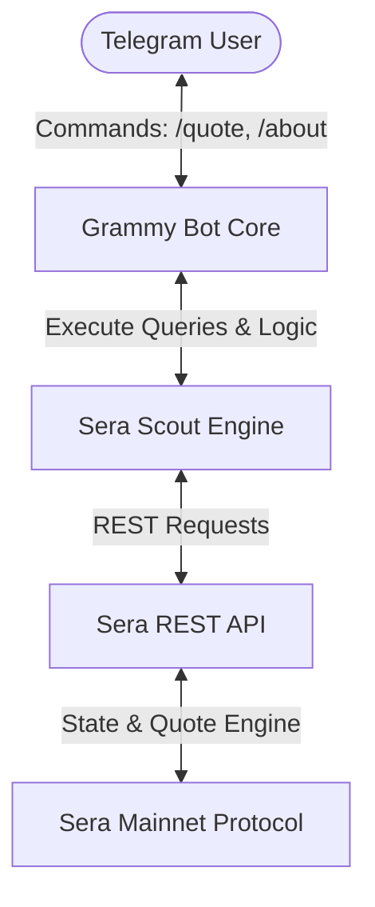
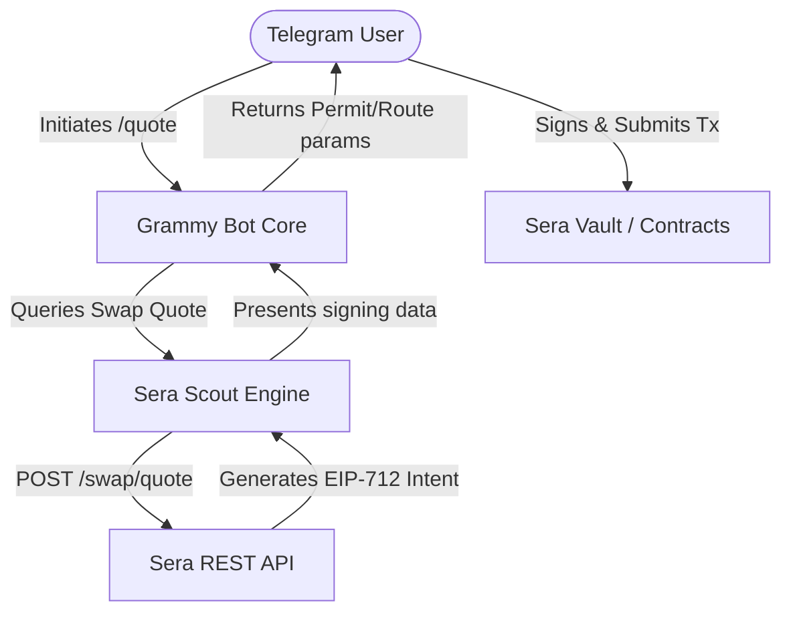

# Sera Scout

[](https://www.typescriptlang.org/)
[](https://grammy.dev/)
[](https://nodejs.org/)

Sera Scout is a Telegram companion bot for the **Sera Protocol** on Ethereum Mainnet. It focuses on market discovery, real-time quote generation, price/liquidity alerts, and future intent-based trading utilities.

---

## Product Vision

Sera Scout is designed to be the ultimate mobile companion for Sera Protocol users. Because Sera Mainnet utilizes a blind order book where order depth is not publicly exposed, traditional open analytics (such as spread boards or market-depth maps) are replaced by intent-based tools, quote engines, and real-time alerts.

---

## Feature Matrix

| Feature | Description | Status | API Source |
| :--- | :--- | :--- | :--- |
| `/quote` | Fetch slippage-protected swap quotes | **Live** | Mainnet REST API |
| `/markets` | List active trading markets and pairs | **Live** | Mainnet REST API |
| `/alert` | Price alert triggers and notifications | **Live** | Mainnet REST API |
| `/watchnewmarkets` | Subscribe to new listing notifications | **Live** | Mainnet REST API |
| `/stats` | View catalog statistics | **Live** | Mainnet REST API |
| `/token` | Explore token details & market count | **Live** | Mainnet REST API |
| `/trending` | Rank tokens by market connection | **Live** | Mainnet REST API |
| `/discover` | Surfaces protocol insights & newest listings | **Live** | Mainnet REST API |
| `/pair` | Lookup market details for a pair | **Live** | Mainnet REST API |
| `/compare` | Compare token dominance & overlapping routes | **Live** | Mainnet REST API |
| `/digest` | Manage daily intelligence summary reports | **Live** | Mainnet REST API |
| `/alpha` | Tightest spread ranking table | *Legacy* | Sepolia Subgraph (GraphQL) |
| `/liquidity` | Leaderboard of deep liquidity pools | *Legacy* | Sepolia Subgraph (GraphQL) |
| `/scan` | Market spread and fee metrics lookup | *Legacy* | Sepolia Subgraph (GraphQL) |

---

## Architecture Flow

Sera Scout operates on a robust API client pipeline directly interfacing with the Sera Protocol Mainnet endpoints.

### Current Architecture: Read-Only Quote Engine


### Future Architecture: Intent Signing & Vault Trading


---

## Bot Command Reference

*   `/start` — Greeting portal and command summary menu.
*   `/about` — Details bot features and architecture.
*   `/quote <FROM> <TO> <AMOUNT>` — Fetches a live swap quote from mainnet (e.g. `/quote USDC USDT 100`).
*   `/markets [filter]` — Lists active trading pairs or filters them by token (e.g. `/markets USDC`).
*   `/alert <FROM> <TO> <above\|below> <rate>` — Configures a price rate trigger alert (e.g. `/alert EURS USDT above 1.08`).
*   `/myalerts` — Lists active alerts for the chat.
*   `/removealert <id>` — Removes a specific alert by its ID.
*   `/watchnewmarkets <on\|off>` — Subscribes or unsubscribes to new market listing notifications.
*   `/stats` — Displays protocol market and token statistics.
*   `/token <symbol>` — Queries details and market connections for a specific token (e.g. `/token USDC`).
*   `/trending` — Displays the most connected tokens based on active market counts.
*   `/discover` — Surfaces protocol insights, dominant tokens, and new listings.
*   `/pair <BASE> <QUOTE>` — Looks up details and related commands for a trading pair (e.g. `/pair USDC USDT`).
*   `/compare <TOKEN1> <TOKEN2>` — Compares connectivity, relative dominance multiplier, and shared trading routes.
*   `/digest <on\|off>` — Activates or deactivates daily scheduled summaries.
*   `/alpha` — Retrieves top 10 tightest spread pairs (*Legacy Sepolia*).
*   `/liquidity` — Ranks top 10 pairs by total liquidity volumes (*Legacy Sepolia*).
*   `/scan <TOKEN>` — Displays spot price and fee metrics (*Legacy Sepolia*).

---

## Product Roadmap

*   **Phase 1 (Completed)**: Implement production-grade Mainnet `/quote` command using the official REST API and decimal-safe conversions.
*   **Phase 2 (Completed)**: Add market discovery features, including active trading pairs listing via `/markets`.
*   **Phase 3 (Completed)**: Build notification and alerts engine (`/alert`) allowing users to monitor price thresholds.
*   **Phase 4 (Completed)**: Implement advanced market monitoring & statistics (`/watchnewmarkets`, `/stats`, `/token`, `/trending`).
*   **Phase 5 (Completed)**: Implement Sera Intelligence Layer (`/discover`, `/pair`, `/compare`, `/digest` schedulers).
*   **Phase 6 (Under Evaluation)**: Build direct account monitoring and trading actions (Balances, Orders, Fills, Intent Execution).

---

## Setup & Local Execution

### Prerequisites

- Node.js (version 20.6.0 or higher is recommended for native `.env` loading)
- NPM

### 1. Installation

Clone your repository, navigate to the folder, and install the standalone dependencies:

```bash
cd sera-scout-bot
npm install
```

### 2. Configure Environment Variables

Create a `.env` file in the root directory:

```env
BOT_TOKEN=your_telegram_bot_token_here
API_BASE_URL=https://api.sera.cx/api/v1
```

### 3. Run the Services

- **Start Telegram Bot** (Starts Grammy bot long-polling along with the legacy background scheduler):
  ```bash
  npm run bot
  ```

- **Run CLI Quote Test**:
  ```bash
  npx tsx src/test-quote.ts
  ```

---

## Legacy Features (Sepolia GraphQL Subgraph)

The repository contains historical GraphQL queries and background schedulers designed to run on the Sepolia testnet subgraph. These files are kept for reference under the `src/services/sera.ts`, `src/services/scout.ts`, and `src/services/scheduler.ts` directories. To run them locally:

*   **Run Caching Test Suite**:
    ```bash
    npm run alpha
    ```
*   **Run Liquidity Test Suite**:
    ```bash
    npm run liquidity
    ```
